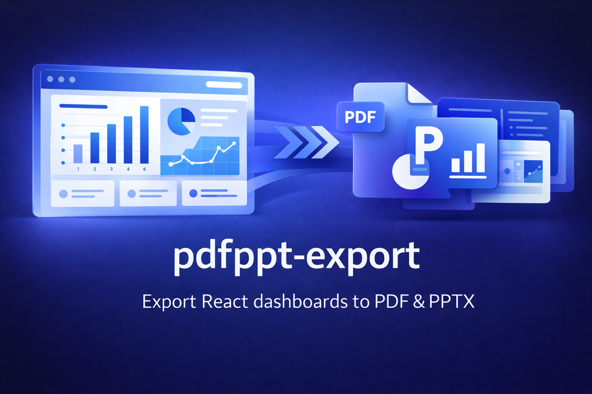

<p align="center">
  
</p>

<h1 align="center">pdfppt-export</h1>

<p align="center">
  Export React dashboards to <strong>multi-page PDFs</strong> and <strong>editable PowerPoint (PPTX)</strong> using real DOM structure — not screenshots.
</p>

<p align="center">
  <a href="https://www.npmjs.com/package/pdf-ppt-export-react">
    
  </a>
  <a href="https://opensource.org/licenses/MIT">
    
  </a>
</p>

---

## ⚠️ Project Status

> **This project is actively under development.**

The core functionality works and is already usable, but:
- Some edge cases may exist
- PPT export logic is complex and evolving
- APIs and internal behavior may improve over time

This is an open, iterative project — **stability and features will improve with community feedback and contributions**.

---

## ✨ What Is This?

**pdfppt-export** is an open-source project that includes:

- 📦 A **React library** (`pdf-ppt-export-react`)  
  Export dashboards to PDF and editable PPTX using real DOM analysis
- 🧪 A **live demo application**  
  Shows real-world usage, patterns, and limitations
- 🧩 A **reference implementation**  
  To understand, customize, and extend the exporter

If your UI renders correctly in the browser, this project aims to export it cleanly.

---

## 🚀 Key Features

### PDF Export
- Multi-page A4 layout
- Smart pagination (no split cards)
- High-quality chart rendering
- Automatic title & date header
- Graceful fallbacks

### PowerPoint Export
- Real editable PPT slides
- Native charts, text boxes, shapes
- Layout-aware panel grouping
- Configurable scaling and slide size
- Optional branded start / end slides

---

## 🔗 Important Links

- 📦 **NPM Package**  
  https://www.npmjs.com/package/pdf-ppt-export-react

- 🌐 **Live Demo**  
  https://pdfppt-export.vercel.app/

- 📘 **Library Documentation**  
  `pdf-ppt-export-react/README.md`

---

## 📂 Repository Structure

```
pdfppt-export/
├── Assets/                    # Logos & cover images
├── demo/                      # Demo application
│   └── README.md              # Demo-specific docs
├── pdf-ppt-export-react/      # React library source
│   └── README.md              # Full API & usage docs
└── README.md                  # (You are here)
```

👉 Start with **`demo/src/Demo.tsx`** to see a complete example.

---

## 🧪 Run the Demo Locally

```bash
git clone https://github.com/DhirajKarangale/pdfppt-export
cd demo
npm install
npm run dev
```

---

## 📦 Install the Library

```bash
npm install pdf-ppt-export-react jspdf html-to-image pptxgenjs culori
```

```ts
import { PDFDownloader, PPTDownloader } from "pdf-ppt-export-react";
```

👉 Full API and advanced usage are documented inside  
**`pdf-ppt-export-react/README.md`**

---

## 🤝 Contributing & Collaboration

This project welcomes contributors.

You can help by:
- Reporting bugs or edge cases
- Improving PPT layout logic
- Adding chart support
- Optimizing performance
- Improving documentation
- Testing across browsers and screen sizes

No contribution is too small.

If you’ve ever needed a better **Export to PDF / PPT** solution in React —  
**this project is for you.**

Open an issue, start a discussion, or submit a pull request.

---

## 🧭 Roadmap (Open)

- Improve PPT layout accuracy
- Better handling of complex grids
- More chart types & themes
- Plugin-style export hooks
- Improved error diagnostics
- Performance tuning for large dashboards

Roadmap will evolve based on real usage and feedback.

---

## 📄 License

MIT © Dhiraj Karangale

---

<p align="center">
  <strong>Built in public • Improving with community • Contributions welcome</strong>
</p>
