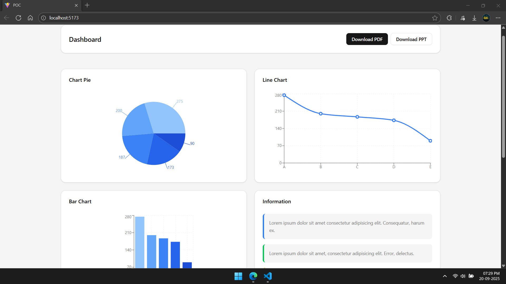
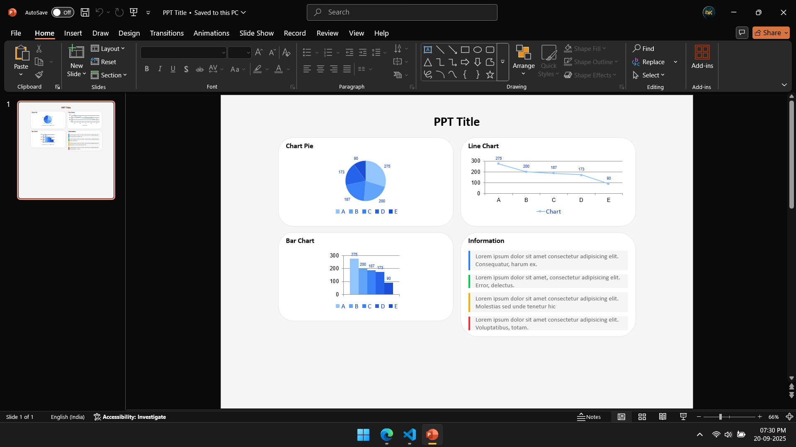

# ⚛️ React POCs Collection

This repository contains a collection of small Proof of Concepts (POCs) built using **React**.  
Each POC demonstrates how to integrate or implement specific libraries, components, or features commonly used in modern React applications.

---

## 🚀 What's Included

### 1. 📄 PDF Downloader
A simple implementation to export part of a React component as a downloadable PDF using:
- `html2canvas`
- `jspdf`
- `html-to-image`

📌 **Features:**
- Capture specific elements using `ref`
- Render charts and content into high-resolution PDFs
- Modal confirmation before download

---

### 2. 📊 PPT Downloader
A POC for exporting React components directly into **PowerPoint (PPTX)** slides using:
- `pptxgenjs`
- `html-to-image`

📌 **Features:**
- Convert charts, text, and styled components into slides
- Support for background, borders, padding, and text alignment
- Exported PPT is **fully editable** in PowerPoint
- Easily extendable for multi-slide exports

---

### 3. 🎨 shadcn/ui Integration
Integration of [shadcn/ui](https://ui.shadcn.com/) — a beautiful, customizable UI component library based on Radix UI and Tailwind CSS.

📌 **Features:**
- Consistent styling with Tailwind
- Easily extendable component set
- Modern UI best practices

---

## 🌐 Live Demo
Check out the live demo here:  
👉 [React POC Live](https://react-poc-fawn.vercel.app/)

---

## 📸 Screenshots

Dashboard Example  


Exported PDF  


Exported PPT  


---

## 🛠️ Getting Started

### Prerequisites
Make sure you have the following installed:
- [Node.js](https://nodejs.org/) (v18 or later recommended)
- [npm](https://www.npmjs.com/)
- Git

### 📦 Installation

```bash
git clone https://github.com/DhirajKarangale/ReactPOC.git
cd ReactPOC
npm install
```

### ▶️ Run the Project
```bash
npm run dev
```

---

## 📚 Dependencies

This project uses the following major dependencies:

- **UI & Styling**
  - `tailwindcss`
  - `shadcn/ui`
  - `lucide-react`
  - `clsx`, `tailwind-merge`, `tailwind-variants`

- **PDF Export**
  - `jspdf`
  - `html2canvas`
  - `html-to-image`

- **PPT Export**
  - `pptxgenjs`
  - `html-to-image`

- **Charts**
  - `chart.js`
  - `react-chartjs-2`
  - `recharts`

- **Radix UI**
  - `@radix-ui/react-dialog`
  - `@radix-ui/react-scroll-area`
  - `@radix-ui/react-separator`
  - `@radix-ui/react-slot`

---

## 🤝 Contributing
Feel free to fork this repo, raise issues, or submit pull requests.  
This project is intended as a **learning playground** and reference for developers exploring React integrations.

---